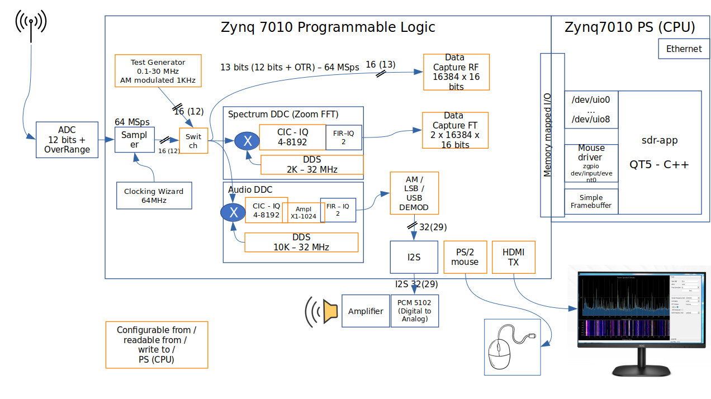

# EBAZ4205_SDR_spectrum
 
## Description

This repository contains:
* Vivado project
* Vitis project
* QT5 app

to display the 0-32 MHz radio spectrum in a full view and tune HF radio stations.
This project is the continuation of https://github.com/guido57/EBAZ4205_Spectrum which is a 0-32 MHz radio spectrum viewer only. 

## Getting Started for FPGA or EBAZ4205 beginners

Before going straight to this project, I strongly reccomend to carefully prepare your HW / SW environment, following the instructions contained in:
* [HW is in my "Cheap (35$) and powerful FPGA Programming" Hackaday project](https://hackaday.io/project/187351-cheap-35-and-powerful-fpga-programming)
* [SW is in my "EBAZ4205" repository](https://github.com/guido57/EBAZ4205)

In this project there's nothing esoteric, but it is quite complex because it requires: 
* Hardware assembling (you can use a solder iron on SMD, don't you?) 
* FPGA Zynq7010 design and programming with Xilinx Vivado 
* flashing Linux on the Zynq7010 FPGA with Xilinx Petalinux
* building a C++ program running on Linux
* building a Python program on Windows

## Getting Started

* [HW is in my "30 MHz Spectrum and SDR in an FPGA" Hackaday project](https://hackaday.io/project/186329-30mhz-spectrum-and-sdr-in-a-fpga)
* SW is here :) 

## Software

The following chapters describe the three main SW sub-projects (folders of this repository)

* Zynq: the Xilinx Vivado project to program the Zynq7010 PL (Programmable Logic)
* Vitis: the Xilinx Vitis project to build the TCP_server Linux app running on the Zynq7010 PS (Processing System)
* sdr-app: the QT5 C++ software for PetaLinux to display the spectrum and tune the radio stations

## Vivado (Zynq)

This is the Xilinx Vivado 2022.2 project that let's you to program the Zynq7010 FPGA (PL side) contained in the EBAZ4205 board. 

After programming it, the EBAZ4205 will:

* supply a 64 MHz clock to the AD9226 board
* receive the 12 bits samples from the AD9226
* receive commands from the Linux sdr-app running on the PS side of the zynq-7000 to:
  * capture a frame of samples (2048 samples at a time)
  * switch between the ADC input and a local RF test generator  
  * change the local RF test generator frequency in the range 100 KHz - 32 MHz
  * tune a radio station 
* down convert and filter (CIC + FIR) the received signal
* demodulate (AM or LSB or USB) and send it to:
*   an external loudspeaker
*   the audio input of the PetaLinux running on PS
* interface a PS/2 mouse
* send HDMI to an external monitor

## Vitis

This is the Xilinx Vitis 2022.2 project that let's you to build a C++ app, named colorbars, running on the Zynq7010 PS to configure the HDMI IPs (Video Timing Controller, Video DMA). This app has also a menu to choose the video format e.g. 1280x720 @ 50Hz and display colorbars for testing purposes.

## sdr-app

This is the QT5 C++ software receiving sampled data from EBAZ4205 and displaying spectrum and waterfall in its User Interface.
It lets you to send commands to EBA4205 also to:
  * switch between the ADC input and a local RF test generator  
  * change the local RF test generator frequency in the range 100 KHz - 32 MHz
  * tune radio stations 
  * change the waterfall colors (TODO)
  * Set IF bandwith and IF gain  
  

## License

* MIT
