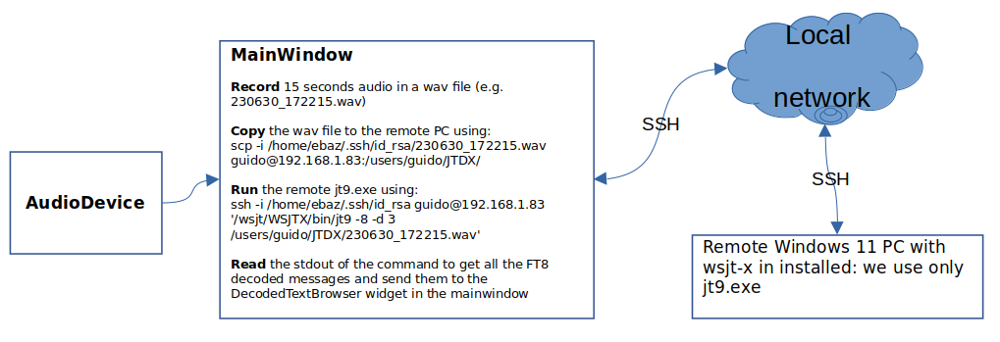

# Copyright

Copyright (C) 2001-2020 by Joe Taylor, K1JT.
Copyright (C) 2016-2020 by Igor Chernikov UA3DJY and Arvo Järve ES1JA.

JTDX is forked from  WSJT-X, a computer  program  dedicated to amateur
radio communication using very weak signals. 

The program runs equally well on Windows, Macintosh and Linux systems,
and installation packages are available for all three platforms.

JTDX  is  an  open-source project released under the  GPL license (See
COPYING). If  you have  programming or  documentation skills  or would
like to  contribute to  the project  in other  ways, please  make your
interests known  to the  development team.

Project Web site: 
http://www.jtdx.tech

Project mailing  list:
https://jtdx.groups.io/g/main

# Overview

This is the myjtdx C++ software to decode FT8 (and maybe other digital modes) using the EBAZ4205_SDR_spectrum project.

# Software architecture

* main.cpp is the classical main for qt5 applications
* mainwindow.cpp is the mainwindow of the user interface of jtdx, pretty similar to the UI of wsjt-x 

The main difference between myjtdx and the original jtdx is that myjtdx uses a remote FT8 decoder, because the Zynq7010 Cortex A9 dual core CPU could be OK to decode FT8 at light deep (-d 1), but it would take too much time to decode FT8 medium (-d 2) and above all deep decoding (-d 3). 

Therefore I use a local (in the same network of EBAZ4205) PC running Windows 11, where the [wsjt-x 2.5.4 is installed](https://sourceforge.net/projects/wsjt/files/wsjtx-2.5.4/).  

.  

