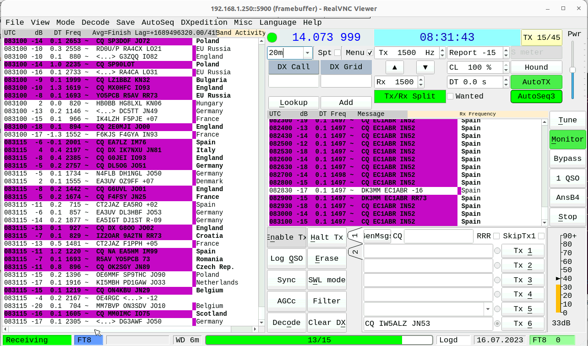

# Copyright

Copyright (C) 2001-2020 by Joe Taylor, K1JT.
Copyright (C) 2016-2020 by Igor Chernikov UA3DJY and Arvo Järve ES1JA.

JTDX is forked from  WSJT-X, a computer  program  dedicated to amateur
radio communication using very weak signals. 

The program runs equally well on Windows, Macintosh and Linux systems,
and installation packages are available for all three platforms.

JTDX  is  an  open-source project released under the  GPL license (See
COPYING). If  you have  programming or  documentation skills  or would
like to  contribute to  the project  in other  ways, please  make your
interests known  to the  development team.


Project Web site: 
http://www.jtdx.tech

Project mailing  list:
https://jtdx.groups.io/g/main

# Overview

This is the "myjtdx" C++ software to decode FT8 (and maybe other digital modes) using the EBAZ4205_SDR_spectrum project.

.  


# Software architecture

* main.cpp is the classical main for qt5 applications
* mainwindow.cpp is the mainwindow of the user interface of jtdx, pretty similar to the UI of wsjt-x 

The main difference between myjtdx and the original jtdx is that myjtdx uses a remote FT8 decoder, because the Zynq7010 Cortex A9 dual core CPU could be OK to decode FT8 at light deep (-d 1), but it would take too much time to decode FT8 medium (-d 2) and above all deep decoding (-d 3). 

Therefore I use a local (in the same network of EBAZ4205) PC running Windows 10, where the [wsjt-x 2.5.4 is installed](https://sourceforge.net/projects/wsjt/files/wsjtx-2.5.4/).  

.  

# SSH setup

To let the myjtdx program to use ssh to connect to the Windows 10/11 ssh server you need to:
* generate the SSH keys (private and public) on  PetaLinux
* copy the SSH public key of PetaLinux to the SSH Windows 10/11 server
* test if everything is OK

## Generate the SSK keys (private and public) on PetaLinux

1) If there's no .ssh directory, create it:

```
cd /home/ebaz
mkdir .ssh
```

2) Because PetaLinux has Dropbear (instead of OpenSSH) to generate the private/public keys in PetaLinux you have to use dropbearkey:

```
cd /home/ebaz/.ssh
dropbearkey -f id_rsa | grep "^ssh-rsa " >> id_pub
```

3) Now the public key is inside the file id_pub, while the private key is in id_rsa.
The public key should be similar to the following:

```
ssh-rsa AAAAB3NzaC1yc2EERFTHTQABAAABAQCEkBDVvu6twWZX0O+824r4q/xVgx+AbFbBA4ceVRGr44/Y8r4mymoc3Dr1gKf0KmQwWU+K07sh25MliFSps8k4KNNmAYXGQlkmGsV40ZRfJ2dsjS6sBENEdJXoPzRhgSs5c+2+bPa48RZ2DGFSDGGDFGDFGDKGHDFGDFJGdgfhgfgofYGt5E/stAk5pSgApA2XbBboNK1f1VMQ/v4hILi2bZzkw3bwnE9orpqFXDRRjVrJWvqgiOvVA7YEwbOwGRikdeGMIUnNAs7YGZ+sMbuZnJf5tDCr5NDqRsGhsFUJd85pqtdRG01MSh3GPspFQh8jBBVNBJkx36HMSXKoPXvDYktjc59BtBaJrP ebaz@ebaz4205
```

## copy the SSH public key of PetaLinux to the SSH Windows 10/11 server

Copy the content of id_pub to the file C:\ProgramData\ssh\administrators_authorized_keys

Restart the SSH server on Windows:
1. executing service.msc
2. Stop OpenSSH SSH Server
3. Start OpenSSH SSH Server

## test if everything is OK

From the PetaLinux shell of EBAZ try:

```
ssh -i /home/ebaz/.ssh/id_rsa guido@192.168.1.83
```
Of course change:
* 192.168.1.83 with the real IP address of your Windows 11 PC
* guido with the Windows 11 user name

Please note that with dropbear you must explicitly specify the local private key using the option -i

```
-i /home/ebaz/.ssh/id_rsa
```

If everything is ok, you should log in the Windows PC without writing any password as here:

```
Microsoft Windows [Versione 10.0.22621.1848]
(c) Microsoft Corporation. All rights reserved.

guido@DESKTOP-SQGSJV7 C:\Users\guido>
```
## ... in case something goes wrong

### Stop the SSH server on Windows:

* executing service.msc
* Stop OpenSSH SSH Server

### Launch the SSH server from a Windows shell, activating the debug option

```
sshd -d
```
### try to SSH login again 

You should see something like this:

```
C:\Windows\System32>sshd -d
debug1: sshd version OpenSSH_for_Windows_8.6, LibreSSL 3.4.3
debug1: get_passwd: lookup_sid() failed: 1332.
debug1: private host key #0: ssh-rsa SHA256:KBTw8CkhD81eI+7KQdjNsZTwgrssLV3QFeAqrF5LPY4
debug1: private host key #1: ecdsa-sha2-nistp256 SHA256:36Rexpew+/FUZCWAK+28reyh06+Bb+TuKJXAxrFZzVM
debug1: private host key #2: ssh-ed25519 SHA256:ysJPdM636UJEZg1rVuFCfn5x3FudJIJPGvoLlBGgS00
debug1: rexec_argv[0]='sshd'
debug1: rexec_argv[1]='-d'
debug1: Bind to port 22 on ::.
Server listening on :: port 22.
debug1: Bind to port 22 on 0.0.0.0.
Server listening on 0.0.0.0 port 22.
```

and when anybody connects:

```
Connection from 192.168.1.250 port 38884 on 192.168.1.83 port 22
debug1: Local version string SSH-2.0-OpenSSH_for_Windows_8.6
debug1: Remote protocol version 2.0, remote software version dropbear_2020.81
debug1: compat_banner: no match: dropbear_2020.81
debug1: sshd version OpenSSH_for_Windows_8.6, LibreSSL 3.4.3
debug1: get_passwd: lookup_sid() failed: 1332.
debug1: list_hostkey_types: rsa-sha2-512,rsa-sha2-256,ssh-rsa,ecdsa-sha2-nistp256,ssh-ed25519 [preauth]
debug1: SSH2_MSG_KEXINIT sent [preauth]
debug1: SSH2_MSG_KEXINIT received [preauth]
debug1: kex: algorithm: curve25519-sha256 [preauth]
debug1: kex: host key algorithm: ssh-ed25519 [preauth]
debug1: kex: client->server cipher: chacha20-poly1305@openssh.com MAC: <implicit> compression: zlib@openssh.com [preauth]
debug1: kex: server->client cipher: chacha20-poly1305@openssh.com MAC: <implicit> compression: zlib@openssh.com [preauth]
debug1: expecting SSH2_MSG_KEX_ECDH_INIT [preauth]
debug1: SSH2_MSG_KEX_ECDH_INIT received [preauth]
debug1: rekey out after 134217728 blocks [preauth]
debug1: SSH2_MSG_NEWKEYS sent [preauth]
debug1: Sending SSH2_MSG_EXT_INFO [preauth]
debug1: expecting SSH2_MSG_NEWKEYS [preauth]
debug1: SSH2_MSG_NEWKEYS received [preauth]
debug1: rekey in after 134217728 blocks [preauth]
debug1: KEX done [preauth]
debug1: userauth-request for user guido service ssh-connection method none [preauth]
debug1: attempt 0 failures 0 [preauth]
debug1: user guido matched group list administrators at line 94
debug1: userauth-request for user guido service ssh-connection method publickey [preauth]
debug1: attempt 1 failures 0 [preauth]
debug1: userauth_pubkey: test pkalg rsa-sha2-256 pkblob RSA SHA256:xIpTvdHxro8WmYV5xyA+7PNVz16YSCBvc9hhM5glgMk [preauth]
debug1: trying public key file __PROGRAMDATA__/ssh/administrators_authorized_keys
debug1: __PROGRAMDATA__/ssh/administrators_authorized_keys:4: matching key found: RSA SHA256:xIpTvdHxro8WmYV5xyA+7PNVz16YSCBvc9hhM5glgMk
debug1: __PROGRAMDATA__/ssh/administrators_authorized_keys:4: key options: agent-forwarding port-forwarding pty user-rc x11-forwarding
Accepted key RSA SHA256:xIpTvdHxro8WmYV5xyA+7PNVz16YSCBvc9hhM5glgMk found at __PROGRAMDATA__/ssh/administrators_authorized_keys:4
Postponed publickey for guido from 192.168.1.250 port 38884 ssh2 [preauth]
debug1: userauth-request for user guido service ssh-connection method publickey [preauth]
debug1: attempt 2 failures 0 [preauth]
debug1: trying public key file __PROGRAMDATA__/ssh/administrators_authorized_keys
debug1: __PROGRAMDATA__/ssh/administrators_authorized_keys:4: matching key found: RSA SHA256:xIpTvdHxro8WmYV5xyA+7PNVz16YSCBvc9hhM5glgMk
debug1: __PROGRAMDATA__/ssh/administrators_authorized_keys:4: key options: agent-forwarding port-forwarding pty user-rc x11-forwarding
Accepted key RSA SHA256:xIpTvdHxro8WmYV5xyA+7PNVz16YSCBvc9hhM5glgMk found at __PROGRAMDATA__/ssh/administrators_authorized_keys:4
debug1: auth_activate_options: setting new authentication options
Accepted publickey for guido from 192.168.1.250 port 38884 ssh2: RSA SHA256:xIpTvdHxro8WmYV5xyA+7PNVz16YSCBvc9hhM5glgMk
debug1: monitor_child_preauth: user guido authenticated by privileged process
debug1: auth_activate_options: setting new authentication options [preauth]
debug1: Enabling compression at level 6. [preauth]
debug1: monitor_read_log: child log fd closed
debug1: Not running as SYSTEM: skipping loading user profile
User child is on pid 11928
debug1: sshd version OpenSSH_for_Windows_8.6, LibreSSL 3.4.3
debug1: get_passwd: lookup_sid() failed: 1332.
debug1: user guido matched group list administrators at line 94
debug1: rekey in after 134217728 blocks
debug1: rekey out after 134217728 blocks
debug1: ssh_packet_set_postauth: called
debug1: Enabling compression at level 6.
debug1: active: key options: agent-forwarding port-forwarding pty user-rc x11-forwarding
debug1: Entering interactive session for SSH2.
debug1: server_init_dispatch
debug1: server_input_channel_open: ctype session rchan 0 win 24576 max 32759
Endebug1: input_session_request
vironment:
  USER=guido
  LOGNAME=guido
  HOME=C:\Users\guido
  PATH=/usr/bin:/bin:/usr/sbin:/sbin:/usr/local/bin
  MAIL=/var/spool/mail/guido
  SHELL=c:\windows\system32\cmd.exe
  TERM=xterm-256color
  SSH_CLIENT=192.168.1.250 38884 22
  SSH_CONNECTION=192.168.1.250 38884 192.168.1.83 22
  SSH_TTY=windows-pty
debug1: channel 0: new [server-session]
debug1: session_new: session 0
debug1: session_open: channel 0
debug1: session_open: session 0: link with channel 0
debug1: server_input_channel_open: confirm session
debug1: Got 82/9 for keepalive
debug1: server_input_channel_req: channel 0 request pty-req reply 0
debug1: session_by_channel: session 0 channel 0
debug1: session_input_channel_req: session 0 req pty-req
debug1: Allocating pty.
debug1: session_pty_req: session 0 alloc windows-pty
debug1: Ignoring unsupported tty mode opcode 1 (0x1)
...
debug1: Ignoring unsupported tty mode opcode 92 (0x5c)
debug1: server_input_channel_req: channel 0 request shell reply 0
debug1: session_by_channel: session 0 channel 0
debug1: session_input_channel_req: session 0 req shell
Starting session: shell on windows-pty for guido from 192.168.1.250 port 38884 id 0
```

