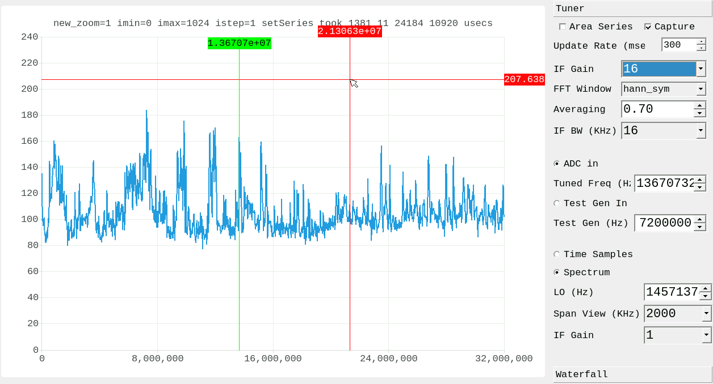

# Overview

This is the sdr-app C++ software receiving sampled data from EBAZ4205 and displaying spectrum and waterfall TODO) in its User Interface.
It lets you to send commands to EBA4205 also to:
  * switch between the ADC input and a local RF test generator  
  * change the local RF test generator frequency in the range 100 KHz - 32 MHz
  * tune radio stations 
  * Set IF bandwith and IF gain  
  

# Software architecture
* main.cpp is the classical main for qt5 applications
* mainwindow.cpp and mainwindow.ui are ... the mainwindow!
* spchartview.cpp is the spectrum window. It handles the sampled data, make the FFT and show it on a chart. It also intercepts the mouse events to change the tuned frequency on mousewheel event and so on
* mysettings.cpp save and restore settings in /home/ebaz/.config/sdr-app/sdr-app.ini
* crosshairs.cpp creates the red vert/horiz pointer
* freqvline.cpp creates the vertical lines:
  * green for the tuned frequency
  * black for the lower and higher bandwidth boundaries
* uio.cpp contains all the classes to interface the hardware components by /dev/uiox. For instance:
  * the switch to set the ADC input or the test generator is handled by the class ADCTestSwitch which maps /dev/uio0
  * the local oscillator is handle by the class DDS which maps /dev/uio3
  * ...
